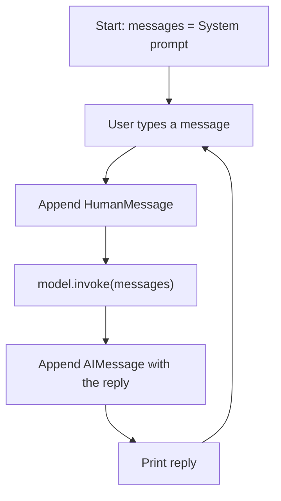

# LangChain Generative AI Playground

A collection of small, focused Python projects for learning how to build LLM applications with **LangChain**. It covers calling chat models from different providers, building a chatbot with memory and personalities, running models locally, and generating text embeddings.

> Built while following the **Generative AI** course by Sheryians AI School.

---

## Table of Contents

- [What's inside](#whats-inside)
- [Project structure](#project-structure)
- [Prerequisites](#prerequisites)
- [Installation](#installation)
- [Configuration](#configuration)
- [Usage](#usage)
- [How it works](#how-it-works)
- [Known limitations](#known-limitations)
- [Roadmap](#roadmap)
- [Troubleshooting](#troubleshooting)
- [Acknowledgements](#acknowledgements)

---

## What's inside

| # | File | What it demonstrates | Runs where | Key needed |
|---|------|----------------------|------------|------------|
| 1 | `chat.py` | Basic single call to a chat model (Mistral) | Cloud | `MISTRAL_API_KEY` |
| 2 | `chatbot.py` | Terminal chatbot with 3 personalities and conversation memory | Cloud | `MISTRAL_API_KEY` |
| 3 | `UIchatbot.py` | The same chatbot as a Streamlit web app | Cloud | `MISTRAL_API_KEY` |
| 4 | `huggingface.py` | Calling a hosted model through Hugging Face (DeepSeek-R1) | Cloud | `HUGGINGFACEHUB_API_TOKEN` |
| 5 | `localmodel.py` | Running TinyLlama fully on your own machine | Local | None |
| 6 | `embeddings.py` | Text embeddings with OpenAI (`text-embedding-3-large`) | Cloud | `OPENAI_API_KEY` |
| 7 | `huggingface_embedding.py` | Free local embeddings with `all-MiniLM-L6-v2` | Local | None |

---

## Project structure

```
.
├── chat.py                     # 1. Single LLM call
├── chatbot.py                  # 2. CLI chatbot with modes + memory
├── UIchatbot.py                # 3. Streamlit chatbot UI
├── huggingface.py              # 4. Hosted Hugging Face model
├── localmodel.py               # 5. Local model (TinyLlama)
├── embeddings.py               # 6. OpenAI embeddings
├── huggingface_embedding.py    # 7. Local Hugging Face embeddings
├── requirements.txt            # Python dependencies
├── .env                        # Your API keys (NOT committed)
├── .env.example                # Template for .env
└── README.md
```

---

## Prerequisites

- Python **3.10+**
- `pip` (and ideally a virtual environment)
- API keys for whichever providers you want to try (see [Configuration](#configuration))
- For `localmodel.py`: about 2 GB of free disk space for the model download, and enough RAM to run a 1.1B-parameter model (a GPU is optional)

---

## Installation

```bash
# 1. Clone the repository
git clone https://github.com/<your-username>/<your-repo>.git
cd <your-repo>

# 2. Create and activate a virtual environment
python -m venv venv
source venv/bin/activate        # macOS / Linux
venv\Scripts\activate           # Windows

# 3. Install dependencies
pip install -r requirements.txt
```

**`requirements.txt`**

```
langchain
langchain-core
python-dotenv
langchain-mistralai
langchain-openai
langchain-huggingface
transformers
torch
sentence-transformers
streamlit
```

> You can install only what you need. For example, if you only want the Mistral chatbot, `langchain-core`, `langchain-mistralai`, `python-dotenv` and `streamlit` are enough.

---

## Configuration

Create a `.env` file in the project root (copy `.env.example`):

```env
MISTRAL_API_KEY=your_mistral_api_key
OPENAI_API_KEY=your_openai_api_key
HUGGINGFACEHUB_API_TOKEN=your_huggingface_token
```

| Variable | Get it from | Used by |
|----------|-------------|---------|
| `MISTRAL_API_KEY` | [console.mistral.ai](https://console.mistral.ai) | `chat.py`, `chatbot.py`, `UIchatbot.py` |
| `OPENAI_API_KEY` | [platform.openai.com](https://platform.openai.com) | `embeddings.py` |
| `HUGGINGFACEHUB_API_TOKEN` | [huggingface.co/settings/tokens](https://huggingface.co/settings/tokens) | `huggingface.py` |

`load_dotenv()` loads these into environment variables at runtime, so keys are never hardcoded.

> ⚠️ **Never commit your `.env` file.** Add it to `.gitignore`:
> ```
> .env
> venv/
> __pycache__/
> ```

---

## Usage

### 1. Single LLM call: `chat.py`
```bash
python chat.py
```
Sends the prompt *"write a poem on AI"* to `mistral-small-2506` (temperature 0.9) and prints the reply.

### 2. Terminal chatbot: `chatbot.py`
```bash
python chatbot.py
```
Choose a personality, then chat. Type `0` to exit.

```
choose your AI mode
press 1 for Angry mode
press 2 for funny mode
press 3 for sad mode
```

### 3. Web chatbot: `UIchatbot.py`
```bash
streamlit run UIchatbot.py
```
Opens at `http://localhost:8501`. Pick a mood with the radio buttons, chat in the browser, and use **Reset Chat** to start over. Changing the mood starts a fresh conversation.

> Use `streamlit run`, not `python UIchatbot.py`.

### 4. Hosted Hugging Face model: `huggingface.py`
```bash
python huggingface.py
```
Calls `deepseek-ai/DeepSeek-R1` through Hugging Face's hosted inference. Availability depends on your Hugging Face access and provider; if it fails, try a smaller instruct model by changing `repo_id`.

### 5. Local model: `localmodel.py`
```bash
python localmodel.py
```
Downloads `TinyLlama/TinyLlama-1.1B-Chat-v1.0` on first run (about 2 GB) and generates text on your machine. No API key and no internet needed afterwards.

### 6. OpenAI embeddings: `embeddings.py`
```bash
python embeddings.py
```
Embeds 3 sentences into **64-dimensional** vectors and prints them.

### 7. Local embeddings: `huggingface_embedding.py`
```bash
python huggingface_embedding.py
```
Embeds the same sentences into **384-dimensional** vectors using `sentence-transformers/all-MiniLM-L6-v2`. Free and offline after the first download.

---

## How it works

### Chat models share one interface

Every chat model in LangChain is used the same way, regardless of provider:

```python
response = model.invoke("your prompt")
print(response.content)
```

Only the class you create changes (`ChatMistralAI`, `ChatHuggingFace`, ...). This is the main reason for using LangChain: it avoids learning a different SDK for every provider.

### Chatbot memory

LLM APIs are **stateless**. The chatbot "remembers" by keeping a list of messages and resending the whole list on every turn:



| LangChain class | Role | Purpose |
|-----------------|------|---------|
| `SystemMessage` | system | Sets behaviour and tone (the "mood") |
| `HumanMessage` | user | The user's input |
| `AIMessage` | assistant | The model's earlier replies |

### Hosted vs local models

| | `huggingface.py` (hosted) | `localmodel.py` (local) |
|---|---|---|
| Class | `HuggingFaceEndpoint` | `HuggingFacePipeline` |
| Runs on | Hugging Face servers | Your machine |
| Needs internet | Every call | Only to download once |
| API key | Yes | No |
| Privacy | Prompt leaves your machine | Stays local |

### Embeddings

An embedding turns text into a list of numbers so that texts with similar meaning end up close together. This is the foundation of semantic search and RAG.

| | `embeddings.py` | `huggingface_embedding.py` |
|---|---|---|
| Model | `text-embedding-3-large` | `all-MiniLM-L6-v2` |
| Vector size | 64 (configurable via `dimensions`) | 384 (fixed) |
| Cost | Pay per token | Free |
| Runs on | OpenAI servers | Your machine |

`embed_documents(list)` returns one vector per text; `embed_query(text)` embeds a single query. Always use the **same** embedding model for documents and queries.

---

## Known limitations

These are known issues in the current code, and good first improvements:

- `chatbot.py` crashes if you enter anything other than `1`, `2` or `3` (the `mode` variable is never set), or a non-number.
- `chatbot.py` appends the exit input `0` to the message history before checking for it.
- `huggingface.py` does not call `load_dotenv()`, so the token in `.env` isn't loaded automatically. Add `from dotenv import load_dotenv; load_dotenv()` at the top.
- Chat history grows without limit, so long conversations increase token cost and can hit the context window.
- `UIchatbot.py` recreates the model on every Streamlit rerun and has no error handling for API failures.
- Model names (e.g. `mistral-small-2506`, `text-embedding-3-large`) change over time. Check each provider's docs if a model is not found.

---

## Roadmap

Planned next steps, following the course plan:

- [ ] Prompt templates and structured (JSON) output
- [ ] Chains using LCEL (`prompt | model | parser`)
- [ ] Streaming responses (`model.stream(...)`)
- [ ] RAG: document loaders, text splitters, vector store (FAISS or Chroma), retriever
- [ ] Agents and tools
- [ ] Final project and deployment

---

## Troubleshooting

| Problem | Likely cause and fix |
|---------|----------------------|
| `AuthenticationError` / 401 | API key missing or wrong. Check `.env` is in the folder you run from and variable names match exactly. |
| `NameError: mode is not defined` | You entered something other than 1, 2 or 3 in `chatbot.py`. |
| `ModuleNotFoundError` | A package is missing. Re-run `pip install -r requirements.txt`. |
| `localmodel.py` is very slow | Expected on CPU. Reduce `max_new_tokens` or use a GPU. |
| `localmodel.py` fails during download | Check your internet connection and free disk space (about 2 GB). |
| Streamlit page does not open | Use `streamlit run UIchatbot.py` and visit `http://localhost:8501`. |
| Hugging Face model unavailable | The hosted model may not be available on your plan. Try a smaller `repo_id`. |

---

## Acknowledgements

- Course: **Generative AI** by Sheryians AI School
- Frameworks: [LangChain](https://www.langchain.com/), [Streamlit](https://streamlit.io/), [Hugging Face](https://huggingface.co/)
- Model providers: [Mistral AI](https://mistral.ai/), [OpenAI](https://openai.com/), TinyLlama, DeepSeek

---

## License

Add a license of your choice (for example MIT) by creating a `LICENSE` file, and update this section.
